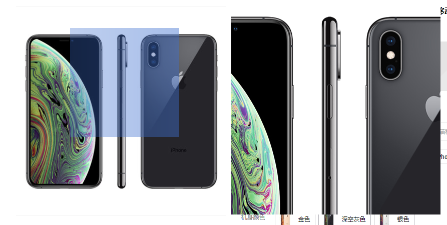

# viewport 介绍

date: [5]
tags: [mobile] [responsive] [rem]

## 事出有因

在pc时代，只有viewport的概念，即视窗口，也就是浏览器看得见的区域，我们一般设置的网页宽度为980px。到了移动时代，手机屏幕变小了，原来pc端的网页在手机上查看缩小了。为什么会出现这种情形呢？为了用户体验考虑，用户不用左右滚动就可以浏览页面水平方向所有内容，下面讲解背后的实现原理。

## viewport

在移动时代，viewport变成了两个概念，即：可视窗口（visual viewport） 和 布局窗口（layout viewport）。布局视窗口和可视窗口的默认宽度是980px。布局视窗口就是网页布局的容器，可视窗口相当于一个矩形选框，它框选的区域会投射到屏幕上显示。效果类似淘宝产品详情页产品相册预览图片的效果。



如上图，相册区域相当于布局视窗口，相册内的蓝色浮动框相当于可视窗口，右边的预览区相当于手机屏幕。滚动页面时，相当于移动可视窗口。

以上就是布局视窗口、可视窗口、手机屏幕三者的联系，那么这者的比例关系及行为表现怎么控制呢？ 就是通过
`<meta name="viewport" content="name=value,name=value">`。

参数说明：

- width: 对loyout viewport的宽度设置
- initial-scale：设置 visual viewport 初始缩放比例及loyout viewport的宽度
- minimum-scale: 设置 visual viewport 最小缩放水平
- maximum-scale: 设置 visual viewport 最大缩放水平
- user-scalable：允许或者禁止用户缩放页面

不用情形，不同表现：

- width是对loyout viewport 宽度的设置，initial-scale是对visual viewport的设置
- 啥都不设置 layout viewport 和 visual viewport 的宽度都等于 980
- 只设置 width, layout viewport 和 visual viewport 的宽度都等于 width;
- 只设置了 initial-scale，那么 layout viewport 和 visual viewport大小都等于屏幕大小/initial-scale;
- 如果既设置了 width 又设置了 initial-scale，那么layout viewport 和 visual viewport都等于各自算出来的值。

tips: 当然所以设置宽度的地方也可以设置高度，如不是设置高度，那么高度为宽度除以设备的宽高比，不过一般不需要关注高度。

## 查看viewport参数

document.documentElement.clientWidt 可获取布局窗口的宽度
window.visualViewport 获取可视窗口信息

```js
visualViewport = {
    // 当该值变化时，触发scroll事件
    double offsetLeft; // Relative to the layout viewport,
    // 当该值变化时，触发scroll事件
    double offsetTop; // and read-only.

    double pageLeft;  // Relative to the document
    double pageTop;  // and read-only.

    //当该值变化时，触发resize事件
    double width;  // Read-only and excludes the scrollbars
    // 当该值变化时，触发resize事件
    double height; // if present. These values give the number
                    // of CSS pixels visible in the visual viewport.
                    // i.e. they shrink as the user zooms in.

    double scale;     // Read-only. The scaling factor applied to
                      // the visual viewport relative to the `ideal
                      // viewport` (size at width=device-width). This
                      // is the same scale as used in the viewport
                      // <meta> tag.
}
```


[web_viewports_explainer](https://github.com/bokand/bokand.github.io/blob/master/web_viewports_explainer.md)
[visual viewport vs layout viewport](https://bokand.github.io/viewport/index.html)
[visual-viewport](https://visual-viewport.glitch.me/)
[WICG/visual-viewport](https://github.com/WICG/visual-viewport)
[fixed-to-viewport](https://wicg.github.io/visual-viewport/examples/fixed-to-viewport.html)
[dom-visualviewport](https://wicg.github.io/visual-viewport/#dom-visualviewport)
[metaviewport](https://www.quirksmode.org/mobile/metaviewport/)
[Visual_Viewport_API](https://developer.mozilla.org/en-US/docs/Web/API/Visual_Viewport_API)
[不要再问我移动适配的问题了](https://segmentfault.com/a/1190000017784801)
[响应式设计——layout viewport、visual viewport以及相关属性](https://www.jianshu.com/p/fb982ea8dce3)


## 参考
[移动端高清、多屏适配方案][1]

[rem自适应方案][2]

[移动端前端开发设计稿及工作流的探索和思考][3]

[iPhone 6 / 6 Plus 出现后，如何改进工作流以实现一份设计稿支持多个尺寸？][4]

[LESS media query mixins][5]

[移动Web页面，为什么都喜欢width=device-width，并且关闭系统缩放功能？][6]

[Are u ok？---记一次H5项目的安卓适配][7]

[1]:http://div.io/topic/1092#devtoutiao.com/16 "移动端高清、多屏适配方案"
[2]:https://github.com/imweb/mobile/issues/3  "rem自适应方案"
[3]:http://www.haorooms.com/post/ydd_qd_workflow "移动端前端开发设计稿及工作流的探索和思考"
[4]:https://www.zhihu.com/question/25308946 "iPhone 6 / 6 Plus 出现后，如何改进工作流以实现一份设计稿支持多个尺寸？"
[5]:http://simbo.github.io/2014/03/less-media-query-mixins.html "LESS media query mixins"
[6]:https://segmentfault.com/q/1010000000305316 "移动Web页面，为什么都喜欢width=device-width，并且关闭系统缩放功能？"
[7]:http://taobaofed.org/blog/2015/10/28/auto-layout-in-h5-project/ "Are u ok？---记一次H5项目的安卓适配"

[100]:https://css-tricks.com/snippets/html/responsive-meta-tag/
